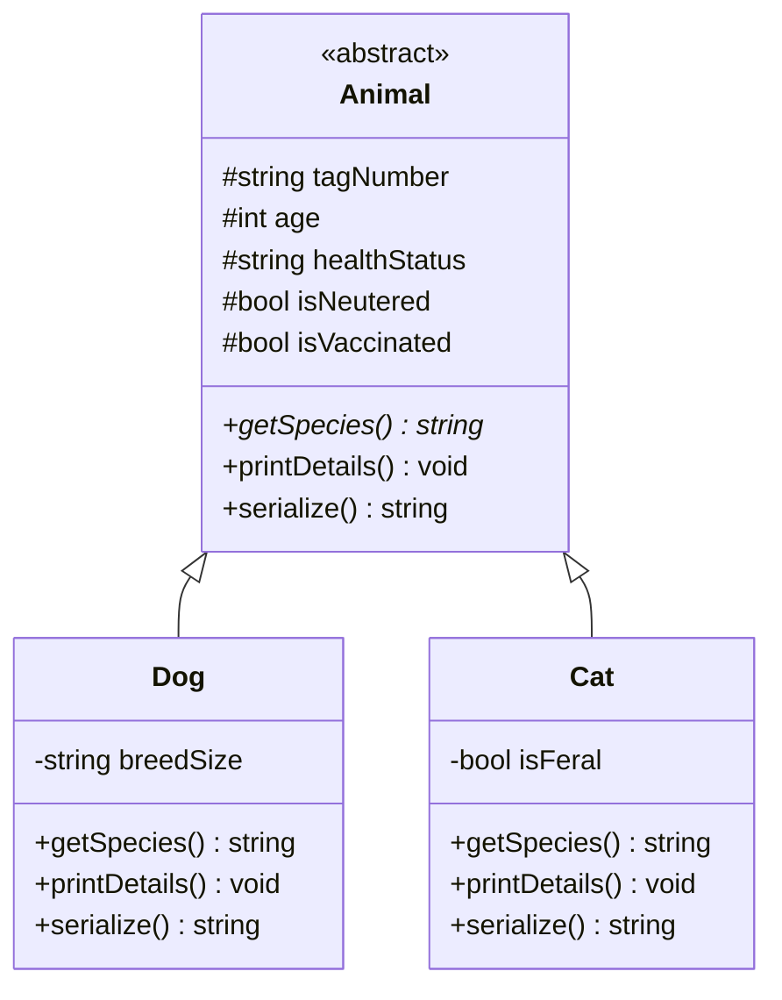

# 🐈 TNVR Management System — OOP Logistics Controller

TNVR Management System is an Object-Oriented C++ command-line application engineered to streamline logistics for **Trap-Neuter-Vaccinate-Return (TNVR)** animal welfare initiatives. The system models dynamic animal records, logs medical status metrics, handles inventory tagging, and persists logs to a local file database.

---

## 🚀 Key Features

* **Object-Oriented Programming (OOP) Design**: Builds a model leveraging C++ core pillars:
  * **Abstraction**: Uses an abstract base class `Animal` with pure virtual species definitions.
  * **Encapsulation**: Restricts direct access to data members via protected fields, exposing safe public getter and setter protocols.
  * **Inheritance**: Models taxonomic entities through specialized subclasses (`Dog`, `Cat`) extending the base animal structure.
  * **Polymorphism**: Implements method overriding and dynamic dispatch (`virtual` functions and destructors) to handle heterogeneous lists via smart pointers (`std::unique_ptr`).
* **File Stream Persistence**: Implements raw CSV file read and write protocols to serialize and load animal logistics databases on startup.

---

## 📂 Repository Contents

* `main.cpp` — Complete compile-ready C++ codebase containing class declarations, logistics management systems, and a CLI entry loop.
* `README.md` — Project documentation.

---

## 🔍 OOP Architecture Overview



### Polymorphism in Action
The logistics manager handles a collection of mixed species using C++ smart pointers referencing the base class:
```cpp
vector<unique_ptr<Animal>> database;
// Dynamic dispatch invokes Dog::printDetails or Cat::printDetails at runtime
for (const auto& animal : database) {
    animal->printDetails(); 
}
```

---

## ⚙️ Compile and Run Instructions

### Using a C++ Compiler (GCC/Clang)
Ensure you have a C++ compiler installed supporting **C++14 or higher**.

1. **Compile**:
   ```bash
   g++ -std=c++14 main.cpp -o tnvr_manager
   ```
2. **Execute**:
   ```bash
   ./tnvr_manager
   ```

### Using Visual Studio
1. Create a new "C++ Console Application" project.
2. Replace `main.cpp` content with the provided codebase.
3. Build and Run the project (`Ctrl + F5`).

---

## 🎓 Academic Credit
Developed as a project for the Object-Oriented Programming (OOP) course at **Beaconhouse National University (BNU)**.
